We invite you to a lecture:
“**Autonomous UAV system for oceanic search and rescue**”

Prof. Stefan Ivić, PhD, head of the research project funded by the Croatian Science Foundation titled “Autonomous UAV system for oceanic search and rescue” (AOSeR), will present the project results, including an overview of its implementation and highlighting the key contributions of the conducted research.

During the five-year project, algorithms for ergodic control of unmanned aerial vehicles were developed and refined for autonomous search operations on land and at sea. The research was supported by numerous field experiments. More than 140 volunteers and staff members participated in field experiments conducted in the Učka Nature Park area.

A real-time sea current field reconstruction system was developed, based on data collection using drifting buoys equipped with GPS sensors and radio transmitters. Understanding sea dynamics enabled efficient control of unmanned aerial vehicles in the search for floating targets. The systems were tested under real conditions in the Plomin Bay area in Istria and Valun Bay on the island of Cres.

The project resulted in more than 300 flight hours, over 25,000 collected photographs, 7 papers published in renowned scientific journals, 12 conference presentations, and 2 completed doctoral dissertations.

The lecture will be held on **Friday, April 10, 2026, at 12:00** in room P1 at the Faculty of Engineering in Rijeka.

 


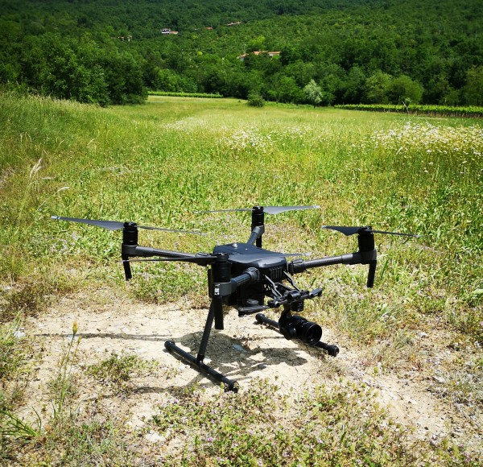
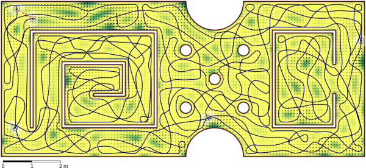
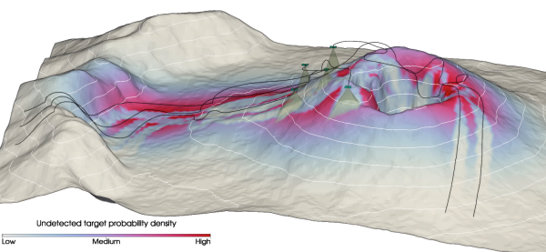
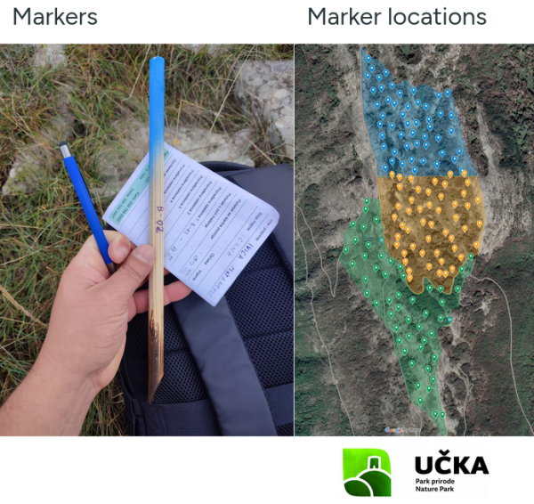

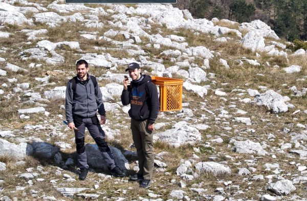
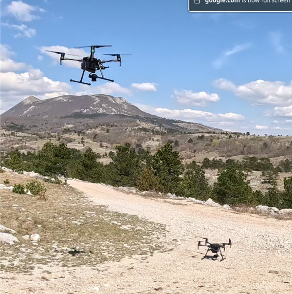
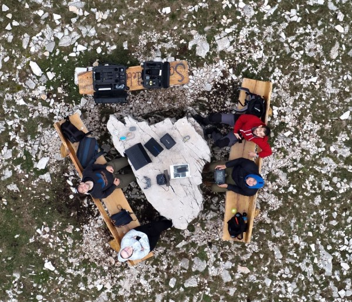
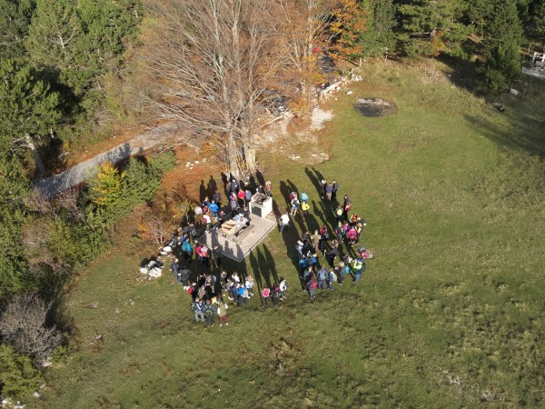

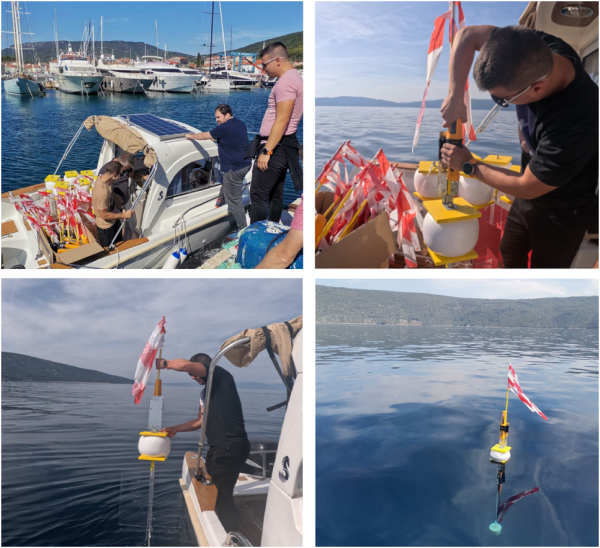
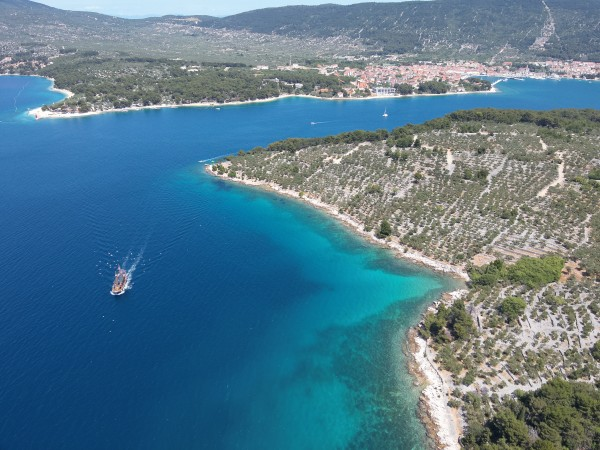
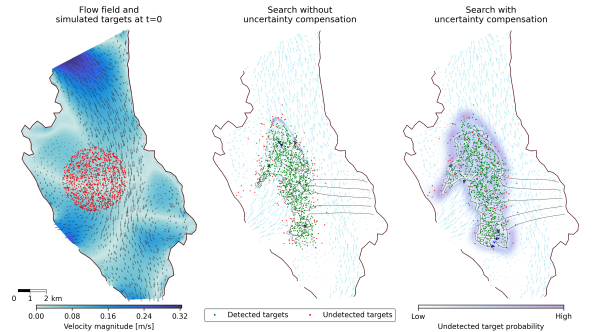
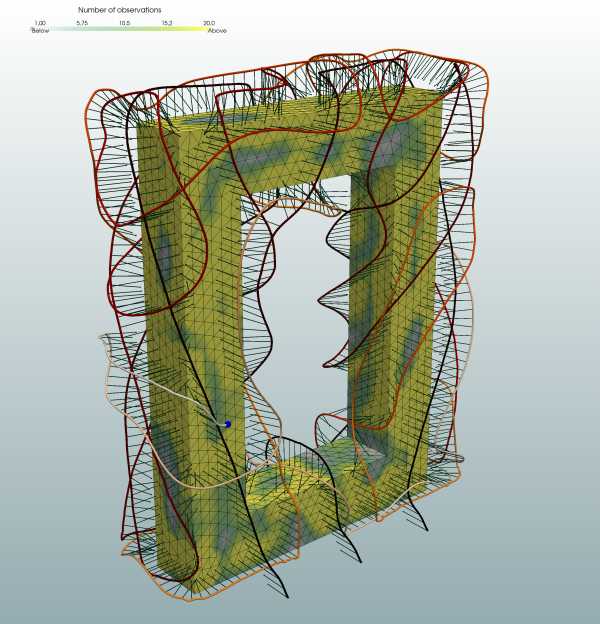

