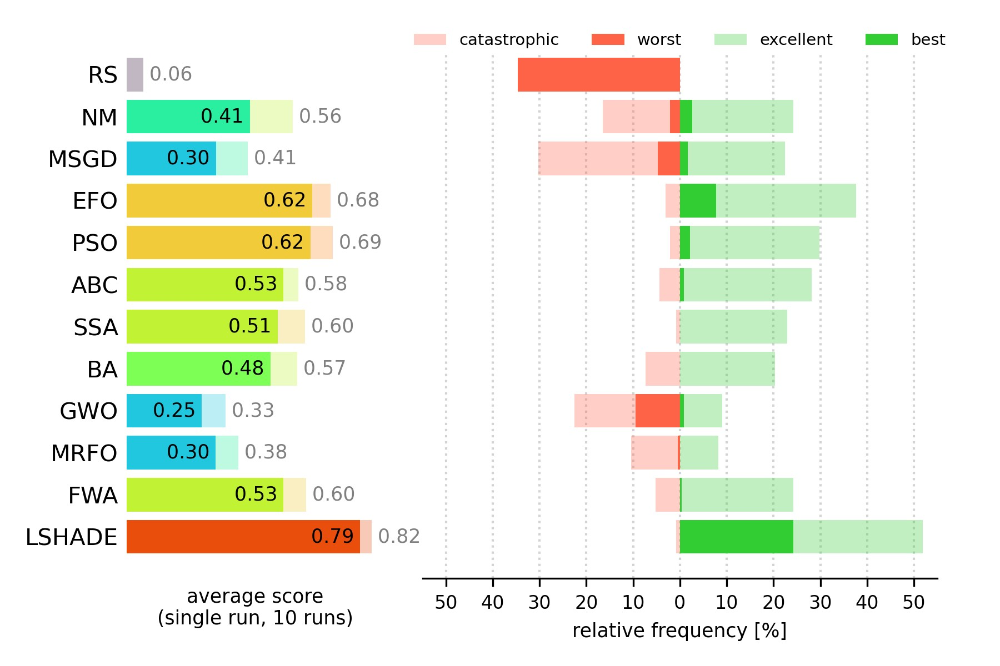
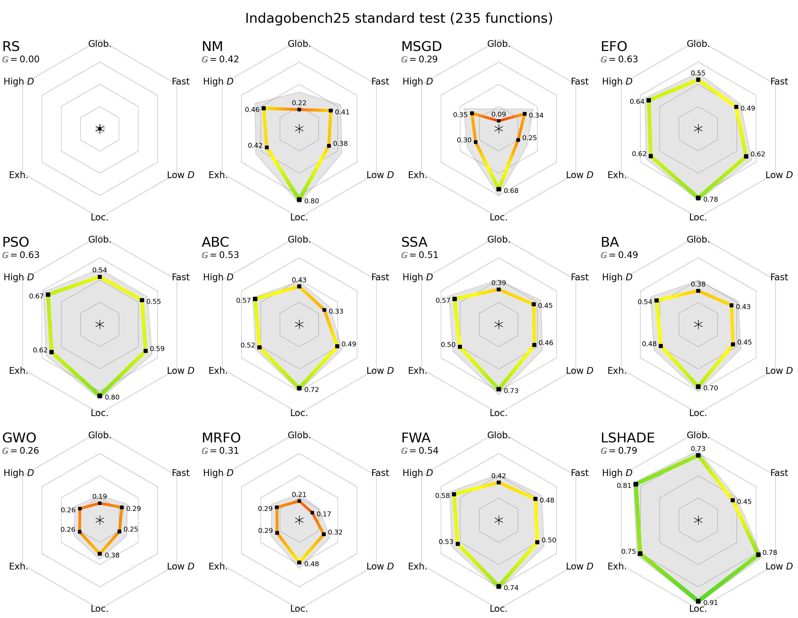
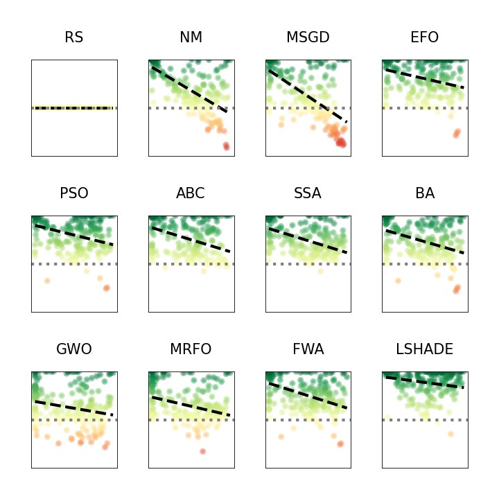
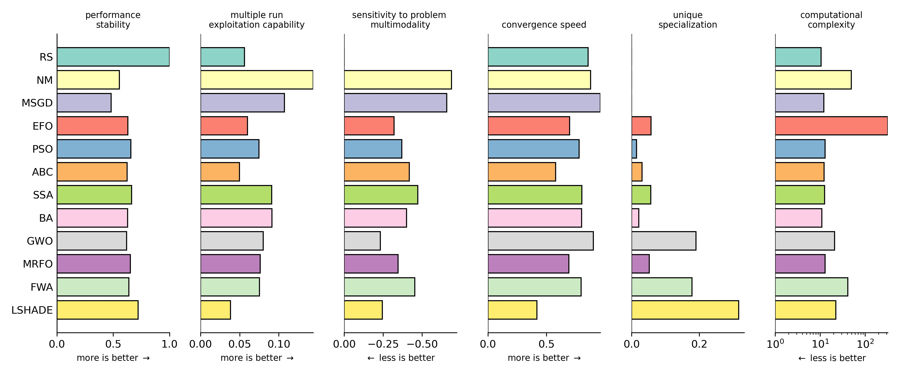

We are happy to announce the new release of Indago!

Check the PyPI for installation ([https://pypi.org/project/Indago](https://pypi.org/project/Indago)) and the documentation ([https://indago.readthedocs.io/index.html](https://indago.readthedocs.io/index.html))

## New features
- New methods: **Heap-Based Optimizer** (HBO), **Controlled Random Search** (CRS)
- New samplers for generating initial population positions (Optimizer.sampler): Sobol ('sobol') and LatinHypercube ('lhs')

## Improvements
- **IndagoBench25 results** overview and corresponding guidelines added to documentation
- Template file for new methods included in the methods library (_new_method_template.py)
- Anakatabatic PSO variants are now using scipy.interpolate.make_interp_spline instead of legacy function interp1d
- Literature reference for MSGD provided in documentation
- LSHADE set as the default DE variant (performs much better than SHADE)
- Optimizer.scatter_method renamed to Optimizer.sampler

## Bug fixes
- Fixed the problem of EFO crashing when using small pop_size values
- Using custom anakatabatic PSO without akb_model parameter now works without errors
- Fixed the error appearing when logging messages for some methods

 




