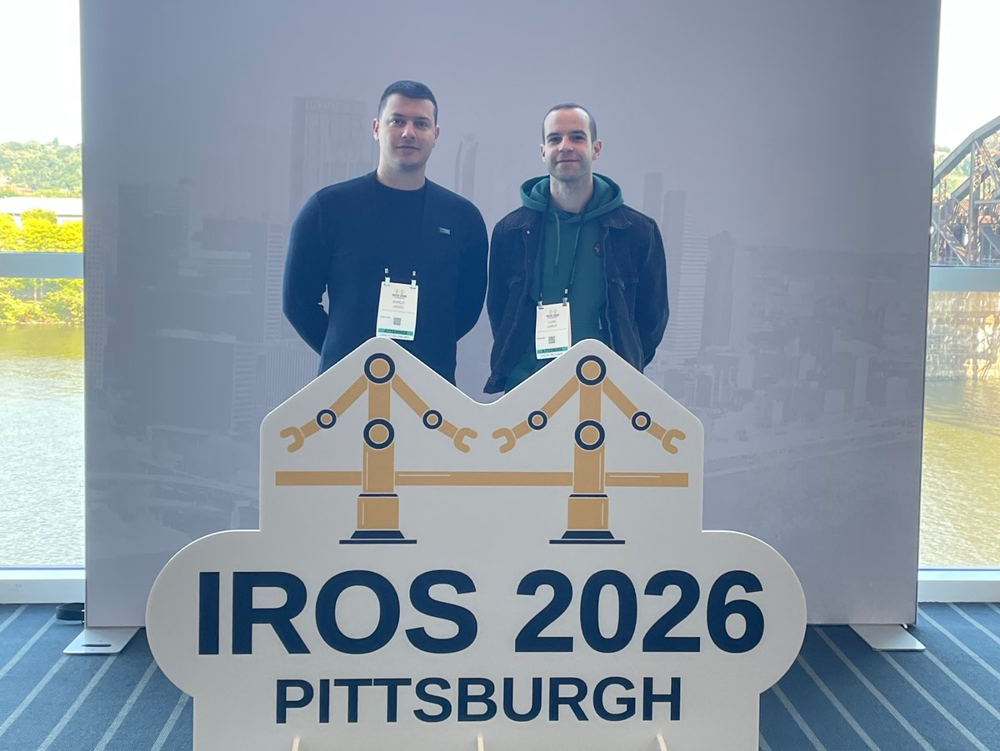
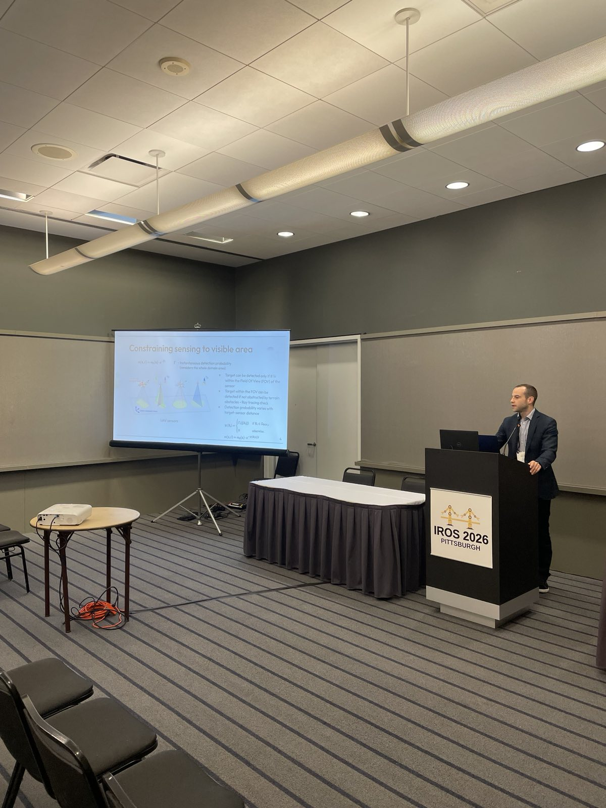
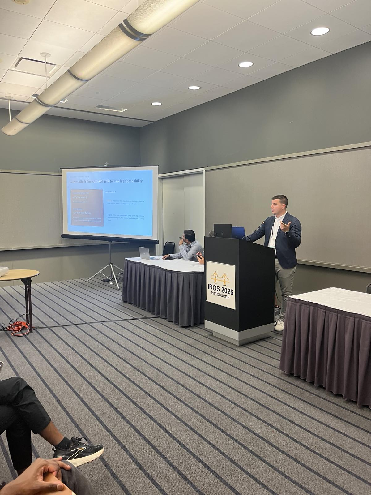
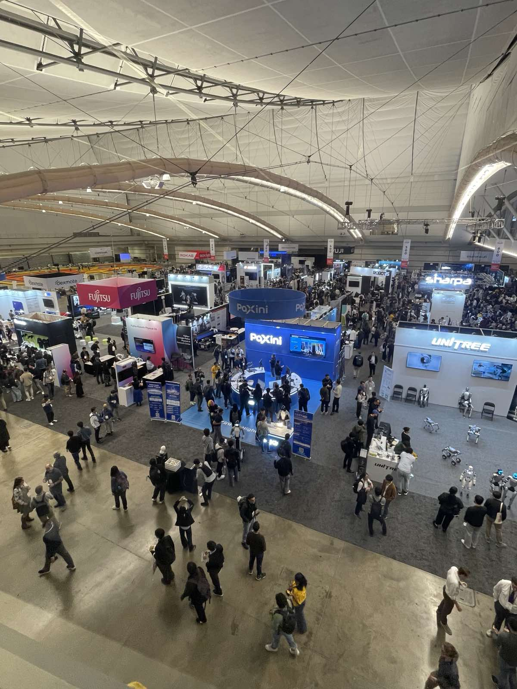
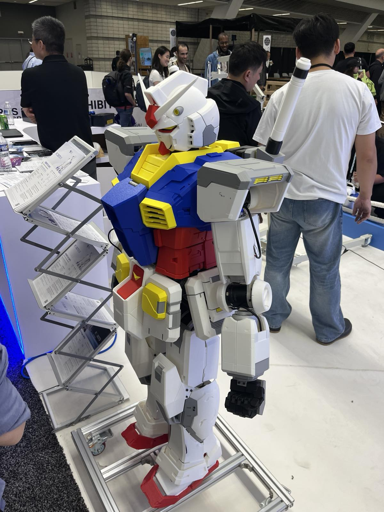
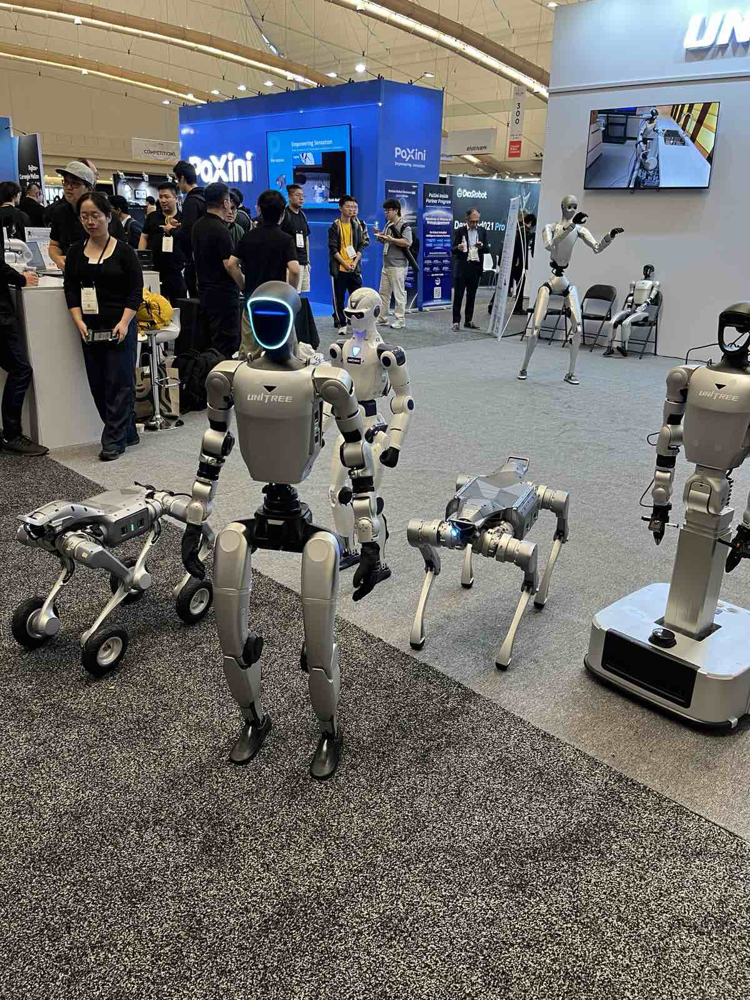
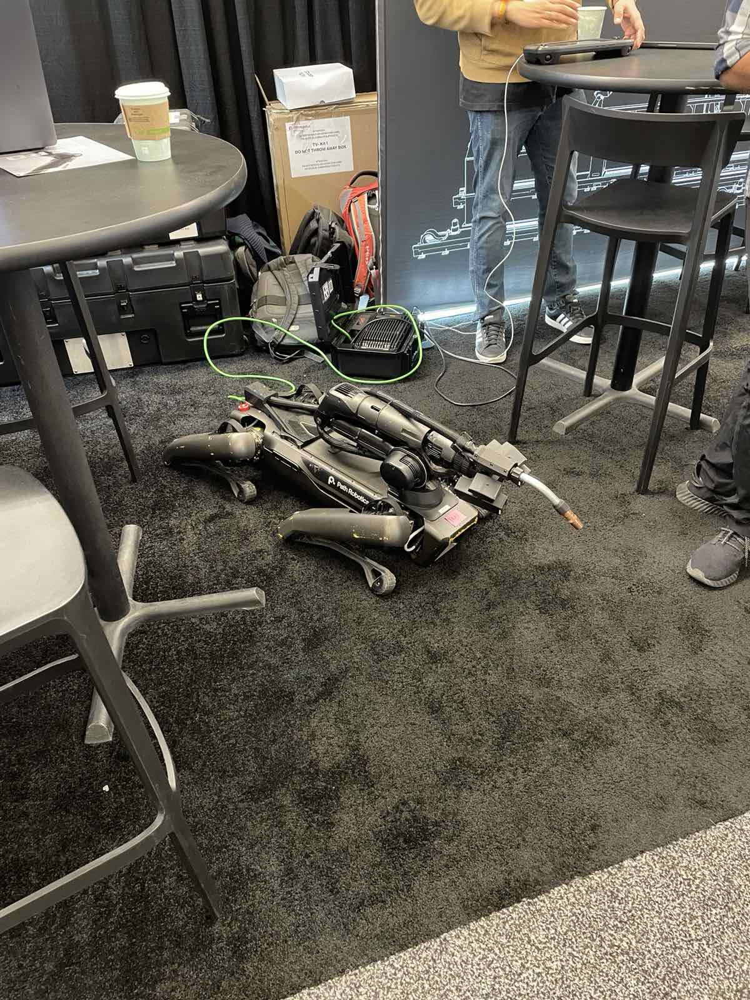
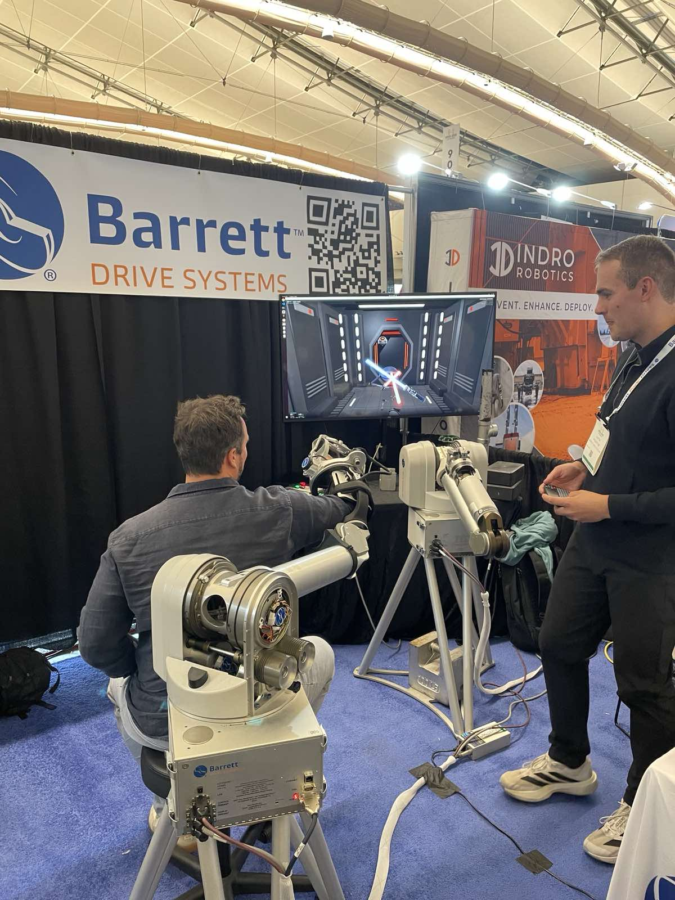

Indago Lab is taking part in IROS 2026, the IEEE/RSJ International Conference on Intelligent Robots and Systems, held this year in Pittsburgh, USA, from September 27 to October 1. IROS is one of the major international robotics conferences, bringing together researchers and industry to present advances across robot perception, planning, control, learning, multi-robot systems, and autonomous systems.

This year, our work is represented by two papers focusing on autonomous multi-robot search.

Karlo Jakac presented **“Ergodic Exploration of Dynamic Distribution”** in the focused session *Ergodic Coverage and Exploration for Robot Teams*. The work extends ergodic exploration to search problems in which the probability distribution itself changes over time, for example, when targets drift according to an environmental flow field. [See the paper](https://ieeexplore.ieee.org/document/11217184)

Luka Lanča presented **“Probabilistic Modeling and Control for Multi-UAV Search Over Uneven Terrain”** in the session *Coordinating Robot Teams in Shared Environments*. This work tackles multi-UAV search over complex terrain by combining probabilistic target modeling, realistic sensing and object-detection performance, ergodic search, and model predictive control. [See the paper](https://ieeexplore.ieee.org/document/11304178)

 




