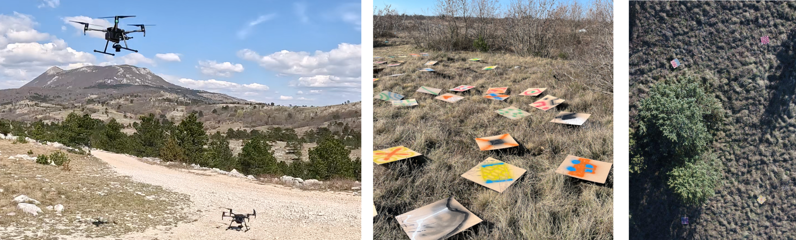

Happy to share that our paper **_Probabilistic Modeling and Control for Multi-UAV Search Over Uneven Terrain_**, by Luka Lanča, Karlo Jakac, and Stefan Ivić, has been accepted for publication in _IEEE Transactions on Robotics_ and is now available on IEEE Xplore.

In this work, we study how multiple UAVs can cooperatively search complex, uneven terrain more effectively. The proposed control framework estimates target detection probability under uncertainty and adapts the search strategy accordingly. The approach combines machine-learning–based detection, ergodic search control, and MPC-based altitude and speed control, while accounting for UAV motion and sensing constraints, detector performance, and terrain features.

While extensive simulations are used to evaluate the control framework under a wide range of conditions, we are particularly proud of the experimental results obtained through numerous field tests. These experiments confirm that the approach performs reliably in real-world environments.

The research, equipment, and field testing were supported by the [AOSER project](../../projects/aoser/), founded by the Croatian Science Foundation ([more info](https://riteh.uniri.hr/znanost/istrazivanje-i-projekti/aoser/)).

You can check out the paper on [IEEE Xplore](https://ieeexplore.ieee.org/document/11304178) and supplementary materials on [OSF](https://osf.io/t947u/).

 

Simulation of multi-UAV search on Mt. Vesuvius:
<video autoplay muted loop playsinline controls width="100%">
  <source src="https://files.de-1.osf.io/v1/resources/t947u/providers/osfstorage/680779bf84a05c9a0d25b074?direct=&mode=render" type="video/mp4">
</video>




Animation of real multi-UAV search on Učka mountain:
<video autoplay muted loop playsinline controls width="100%">
  <source src="https://files.de-1.osf.io/v1/resources/t947u/providers/osfstorage/68078120a61c7a885039a7ed?direct=&mode=render" type="video/mp4">
</video>

