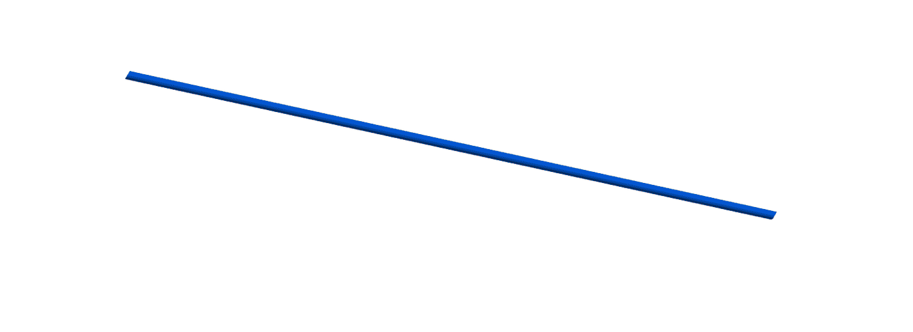
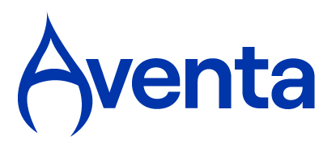

**Research and software development project with Aventa Adriatic d.o.o.**

April - September 2026

The objective of the project is to develop and validate computational models and a prototype software solution for the in-place finite element analysis of subsea pipelines, that is, the assessment of a pipeline resting on the seabed, under operational thermal and mechanical loads.

The work comprises a review of existing finite element approaches for in-place pipeline analysis and implementation of a Python-based toolbox that enables the setup and automation of such simulations. Software solution is accompanied by automated testing, validation on test cases, and technical documentation.

The project is carried out for an industry partner and its results are subject to a confidentiality agreement, so implementation details and results are not publicly available.

**Principal Investigator:** Stefan Ivić.

**Team:** Karlo Jakac, Luka Lanča, Ante Sikirica.

 

  
  

